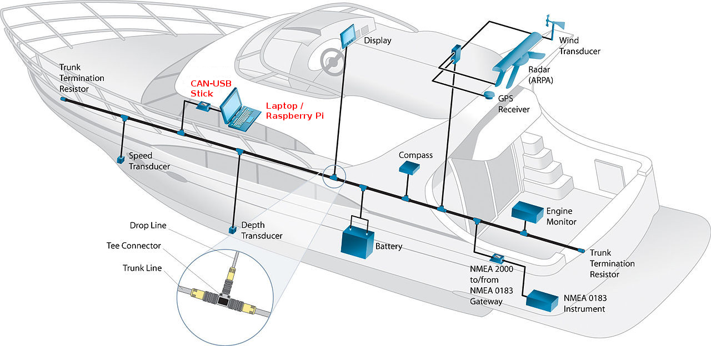

# CAN-USB Stick

## Project

The CAN-USB Stick project was done to analyse the data stream on a N2K network sending and receiving CAN messages. It is electrically isolated to avoid damages.

The program of the MCU has been re-engineered to work together with [CANBOAT](https://github.com/canboat/canboat) project, which is used by [Signal K](http://signalk.org/) project. Both packets are used in OpenPlotter.

The CAN-USB Stick does also work with [OpenSkipper](http://openskipper.org/) project.

Not tested:

* [MacENC](http://macenc.com/)
* [PolarView NS](http://www.polarnavy.com/)

So it does use the command set which is used in the CANBOAT actisense-serial program. Sending and receiving data into the N2K network can be done directly from OpenPlotter too.

New PGNs are not blocked, as they are on other devices capable to work with CANBOAT. The transmission speed can be set higher than the CAN bus speed. Other devices capable to work with CANBOAT have a lower transferrate than N2K networks and they may suffer a bottleneck.


This item is available in our [Web Shop](http://shop.sailoog.com).


## Hardware

The CAN-USB Stick V2 is based on a stm32 micro-controller \(MCU\) connected to an isolated CAN transceiver and an USB to serial converter.

### Warning / Disclaimer {#warning--disclaimer}

CAN-USB Stick is a research project on data communication on CAN bus and N2K networks in boats.

The software is still under development and has not been fully tested. Malfunctions of the CAN-USB Stick or any connected device might be possible at any time. Manipulating your N2K network could cause damage to connected devices.

Do not rely on data from this device and do not use it as primary source for navigation. Liability cannot be accepted for any damages, personal injuries or malfunctions caused by this device.

The CAN-USB Stick is not certified by NMEA®.

It is not allowed to use the Actisense® NMEA Reader software for the CAN-USB Stick.

### N2K networks {#n2k-networks}

