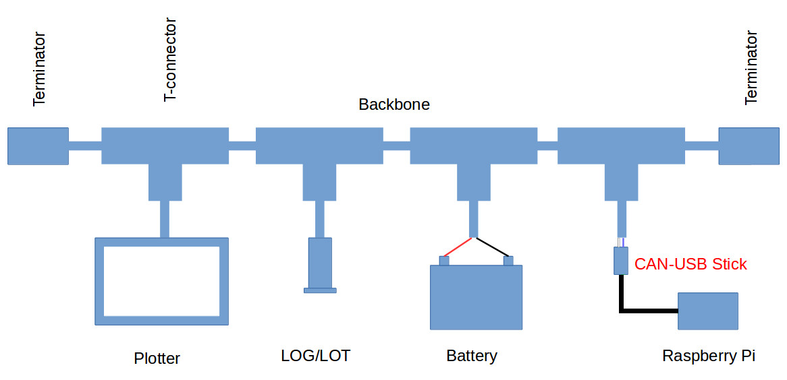

# CAN-USB Stick

## Project

The CAN-USB Stick project was done to analyse the data stream on a N2K network sending and receiving CAN messages. It is electrically isolated to avoid damages.

The CAN-USB Stick is based on a stm32 micro-controller \(MCU\) connected to an isolated CAN transceiver and an USB to serial converter.

The program of the MCU has been re-engineered to work together with [CANBOAT](https://github.com/canboat/canboat) project, which is used by [Signal K](http://signalk.org/) project. Both packets are used in OpenPlotter.

The CAN-USB Stick does also work with [OpenSkipper](http://openskipper.org/) project.

Not tested:

* [MacENC](http://macenc.com/)
* [PolarView NS](http://www.polarnavy.com/)

So it does use the command set which is used in the CANBOAT actisense-serial program. Sending and receiving data into the N2K network can be done directly from OpenPlotter too.

New PGNs are not blocked, as they are on other devices capable to work with CANBOAT. The transmission speed can be set higher than the CAN bus speed. Other devices capable to work with CANBOAT have a lower transferrate than N2K networks and they may suffer a bottleneck.


This item is available in our [Web Shop](http://shop.sailoog.com).


## Warning / Disclaimer

CAN-USB Stick is a research project on data communication on CAN bus and N2K networks in boats.

The software is still under development and has not been fully tested. Malfunctions of the CAN-USB Stick or any connected device might be possible at any time. Manipulating your N2K network could cause damage to connected devices.

Do not rely on data from this device and do not use it as primary source for navigation. Liability cannot be accepted for any damages, personal injuries or malfunctions caused by this device.

The CAN-USB Stick is not certified by NMEA®.

It is not allowed to use the Actisense® NMEA Reader software for the CAN-USB Stick.

## N2K networks

N2K networks are described in [Wikipedia](https://en.wikipedia.org/wiki/NMEA_2000). The backbone \(or trunk\) starts with a 120Ω terminator and ends with a 120Ω terminator. Two resistors are working in parallel, so the resistance is 120Ω/2=60Ω. If there is a broken connection in the backbone you can measure only 120Ω or nothing but not 60Ω. That is a very easy way to check the bus.

The drop line to devices should not be longer than 6 m. The backbone can have 100m in length.

The CAN-USB Stick is electrically isolated so devices and your computer are protected even if they are powered by a different source than your N2K network.

## Connection

To connect the CAN-USB Stick to the network you need a free T-connector on your backbone and a drop line. The drop line should have a M12, 5 pin male connector in one side and 5 wires \(but we only need 2\) in the other side. The HIRSCHMANN ELST 5012 PG7 connector has a screw terminal.

* Pull out the green screw terminal of the stick.
* Connect the drop line blue wire from pin 5 \(pin in the middle\) to the green terminal on CANL.
* Connect the drop line white wire from pin 4 to the green terminal on CANH.
* Turn off the main power switch to be sure that there is no power on the network.
* Connect the drop line to the free T-connector on your backbone.
* Use a multimeter and measure the resistance between CANH and CANL \(on the screws\). The resistance should be around 60 Ohm.
* Connect the green screw terminal to the CAN-USB Stick.
* Check again the 60 Ohm between CANH and CANL.
* On the drop line there are three cables left. They have to be isolated.
* Turn on the main power.
* Switch on instrumentation.

To configure your CAN-USB Stick on Windows use OpenSkipper To configure it on OpenPlotter go to chapter:



## LED

The CAN-USB Stick LED will be **OFF** 10" during the boot sequence and then:

* Fixed **ON** if it is not connected to the network.
* **ON** for a second if it is connected to the network.
* Fixed **OFF** if there are not input data.
* **FLASHING** if there are input data.

## Support

If you need support or you have any suggestion you can publish your questions on [OpenMarine forum](http://forum.openmarine.net/forumdisplay.php?fid=11).

