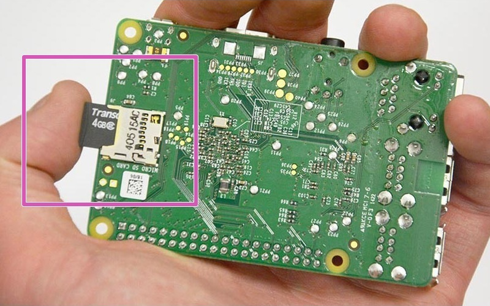

# Getting started

First of all you have to put together at least all the required hardware parts:



Then, you have to run the software on your Raspberry. **OpenPlotter** is a modified version of [Raspbian](https://www.raspbian.org/), the official operating system for the Raspberry Pi. It contains all you need. OpenPlotter is open-source and free.

## Installing OpenPlotter

Raspberry Pi and most embedded system use an SD card as hard disk. almost any micro-SD-compatible card will work on your Raspberry. However, there are some guidelines that should be followed:


A minimum of 8GB is required but 16GB is recommended.



The card class determines the sustained write speed for the card; a class 4 card will be able to write at 4MB/s, whereas a class 10 should be able to attain 10 MB/s. However it should be noted that this does not mean a class 10 card will outperform a class 4 card for general usage, because often this write speed is achieved at the cost of read speed and increased seek times.


To begin with, it's always a good idea to make sure you have formatted your SD card. You'll need to make sure your computer has a built-in SD card reader, or you can use an USB SD card reader.

* Visit the [SD Association’s website](http://www.sdcard.org//) and download [SD Formatter](https://www.sdcard.org/downloads/formatter_4/index.html) program for either Windows or Mac.
* Follow the instructions to install the software.
* Insert your SD card into the computer or laptop’s SD card reader and make a note of the drive letter allocated to it, e.g.` F:/`
* In SD Formatter, select the drive letter for your SD card and format it.


If your SD card has 64GB or more, it will automatically be formatted as exFAT, which is not compatible with OpenPlotter. Follow [these instructions](https://www.raspberrypi.org/documentation/installation/sdxc_formatting.md) to force your SD card to format as FAT32 so that you can use OpenPlotter.


* Download the latest NOOBS installer version of **OpenPlotter. **It is a compressed file of about 1GB so it will take a while. 
* Extract the files from the zip.
* Drag all the files in the extracted NOOBS folder and drop them onto the SD card drive.
* The necessary files will then be transferred to your SD card.
* When this process has finished, safely remove the SD card and insert it into your Raspberry Pi.

## First boot

## H**eadless**

## First settings

## Updating {#updating-openplotter}

## Backup

## Recovery system

