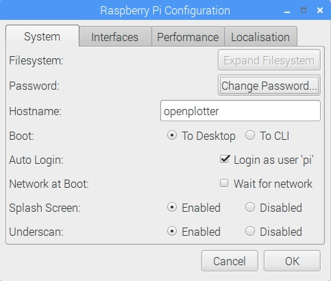
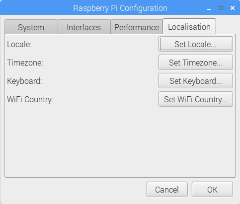

# Getting started

First of all you have to put together at least all the required hardware parts:



Then, you have to run the software on your Raspberry. **OpenPlotter** is a modified version of [Raspbian](https://www.raspbian.org/), the official operating system for the Raspberry Pi. It contains all you need. OpenPlotter is open-source and free.

## Installing OpenPlotter

Raspberry Pi, and most embedded systems, uses an SD card as Hard Disk. Almost any micro-SD-compatible card will work on your Raspberry. However, there are some guidelines that should be followed:


A minimum of 8GB is required but 16GB is recommended.


To begin with, it's always a good idea to make sure you have formatted your SD card. You'll need to make sure your computer has a built-in SD card reader, or you can use an USB SD card reader.

* Visit the [SD Association’s website](http://www.sdcard.org//) and download [SD Formatter](https://www.sdcard.org/downloads/formatter_4/index.html) program for either Windows or Mac.
* Follow the instructions to install the software.
* Insert your SD card into the computer or laptop’s SD card reader and make a note of the drive letter allocated to it, e.g. `F:/`
* In SD Formatter, select the drive letter for your SD card and format it.


If your SD card has 64GB or more, it will automatically be formatted as exFAT, which is not compatible with OpenPlotter. Follow [these instructions](https://www.raspberrypi.org/documentation/installation/sdxc_formatting.md) to force your SD card to format as FAT32 so that you can use OpenPlotter.


* Download the latest NOOBS installer version of **OpenPlotter.** It is a compressed file of about 1GB so it will take a while. 
* Extract the files from the zip.
* Drag all the files in the extracted NOOBS folder and drop them onto the SD card drive.
* The necessary files will then be transferred to your SD card.
* When this process has finished, safely remove the SD card and insert it into your Raspberry Pi.

## First boot

Connect power to the Raspberry Pi.

OpenPlotter NOOBS installer will make a silent install, this means that you do not have to do anything. It will take several minutes to format partitions and install the system.

Once the OpenPlotter NOOBS installer has installed OpenPlotter, it will start directly every time we connect the Raspberry Pi.

## H**eadless**

## First settings

The nativ monitor resolution for 800x480 monitors will be auto detected. The right settings for it will work on the next boot! If we have such a monitor. We do a restart.

Go to `Menu > Preferences` and select `Raspberry Pi Configuration`

A window will open where you can personalize your system. 


It is a good idea to change the password to make OpenPlotter more secure. Click on `Change Password` \(default password: raspberry\).


If you need to set your system localisation, click on the `Localisation` tab and then on `Set Locale` \(language\), `Set Timezone`_,_ `Set Keyboard` and __`Set WiFi Country` buttons.

## Updating {#updating-openplotter}

## Backup

## Recovery system

If our system gets damaged or unstable, we can recover it from the NOOBS installer and install OpenPlotter again. Press the Shift key when you see this symbol at startup:


**We will lose all data, manually installed programs and settings after recovering.**


