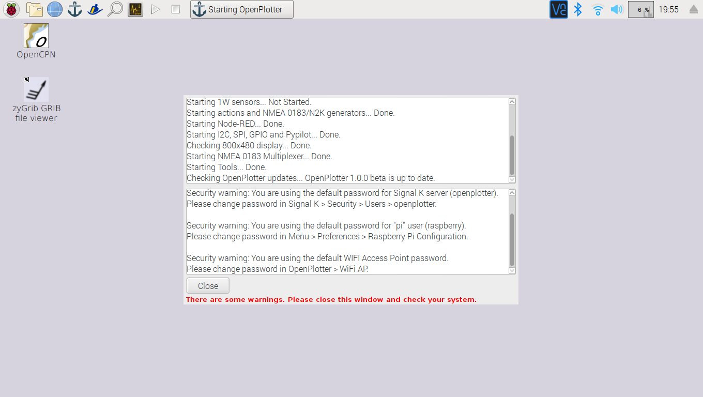

# Empezando

Antes que nada reúna por lo menos los elementos requeridos de hardware:



Después, ejecute el software en su Raspberry. **OpenPlotter** es una versión modificada de [Raspbian](https://www.raspbian.org/), el sistema operativo oficial para la Raspberry Pi. Tiene todo lo que pueda necesitar. OpenPlotter es software de código abierto y libre.

## Instalando OpenPlotter

Raspberry Pi, y la mayoría de sistemas embebidos, utilizan una tarjeta micro-SD como disco duro. Casi todas las tarjetas compatibles micro-SD funcionarán en su Raspberry.


Se requiere un mínimo de 8GB pero se recomiendan 16GB.


Para empezar, es siempre una buena idea asegurarse de que ha formateado su tarjeta micro-SD. Asegúrese de que su ordenador tiene un lector de tarjetas SD integrado o utilice, en otro caso, un lector USB de tarjetas micro-SD.

* Visite la [Web de la Asociación SD](http://www.sdcard.org) y descargue el programa [SD Formatter](https://www.sdcard.org/downloads/formatter_4/index.html) para Windows o Mac.
* Siga las instrucciones para instalar el programa.
* Inserte su tarjeta micro-SD en lector de tarjetas SD de su ordenador o portátil y tome nota de la letra de unidad asignada a aquella, por ejemplo `F:/`
* En SD Formatter, selecciones la letra de unidad de su tarjeta micro-SD y formatéela.


Si su tarjeta micro-SD tiene 64GB o más, será automáticamente formateada como exFAT, que no es compatible con OpenPlotter. Siga [estas instrucciones](https://www.raspberrypi.org/documentation/installation/sdxc_formatting.md) para formatear su tarjeta micro-SD como FAT32 para que pueda usar OpenPlotter.


* [Download the latest NOOBS installer version of **OpenPlotter**](http://www.sailoog.com/blog-categories/openplotter-rpi)**.** It is a compressed file of about 1GB so it will take a while. 
* Extract the files from the compressed file **openplotter\_vx.x.x\_noobs.zip**
* Drag all the files in the extracted NOOBS folder and drop them onto the SD card drive.
* The necessary files will then be transferred to your SD card.
* When this process has finished, safely remove the SD card and insert it into your Raspberry Pi.

## First boot

Connect power to the Raspberry Pi.

OpenPlotter NOOBS installer will make a silent install, this means that you have to do nothing. It will take several minutes to format partitions and install the system.

Once the OpenPlotter NOOBS installer has installed the system, OpenPlotter will start directly every time we connect the Raspberry Pi.

The native monitor resolution for 800x480 monitors will be auto detected. The right settings for it will work on the next boot! If you have such a monitor, restart.

OpenPlotter is configured as a WiFi access point by default. You can connect to it using this pasword:

SSID: openplotter  
Password: 12345678


You should change this password as soon as possible. Other important settings should be changed, please go to _First settings_ page to know how.




You can also run OpenPlotter without monitor \(headless\) using any laptop, desktop computer, tablet or smart-phone as a remote desktop client.



## Updating

From OpenPlotter  v0.10.0, you can update your installation without need of burning a new SD card.

Be sure you are connected to Internet and go to _Updates_ in the OpenPlotter main menu and then to _Update OpenPlotter_. OpenPlotter will check if you need to do a minor or a major update and it will do all the work for you.

You can also update OpenCPN and plugins to the latest stable releases and restore the desktop settings if it has changed after an update.

### Version numbering {#version-numbering}

OpenPlotter releases have three numbers: **a**.**b**.**c** \(v0.10.0, v1.0.0...\) and a word \(**alpha**, **beta** and **stable**\).

When **c** increases, there is a minor change and means that only the OpenPlotter code has changed. When **b** increases, there is a major change and means that other packages or dependencies need to be added or updated too. When **a** increases, there is an upgrade and means that Raspbian needs to be upgraded. In this case a new OpenPlotter image will be released and you have to burn a new SD card.

**Alpha** means that some parts still need development. **Beta** means that all parts have been developed and there are not fatal errors but it needs to be tested by users in different scenarios. Text will be translated from English into other languages on this stage. **Stable** means that OpenPlotter code and dependencies have already been tested and there are not errors.

You can know what version you are running selecting the option _About_ in _Help_ menu.

## Backup

## Recovery system

If our system gets damaged or unstable, we can recover it from the NOOBS installer that resides on your SD and install OpenPlotter again. Press the Shift key when you see this symbol at startup:


**You will lose all data, manually installed programs and settings after recovering.**


