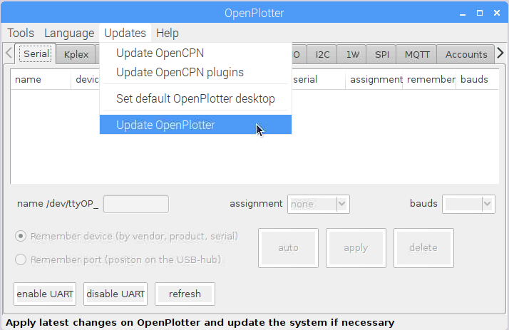

# Par où commencer?

Tout d'abord, il vaus faut assembler les éléments prérequis:



Puis, éxécuter le logiciel sur votre Raspberry. **OpenPlotter** est une version modifiée de Ra[spbian](https://www.raspbian.org/), l'OS officiel pour Raspberry Pi. Tout ce dont vous avez besoin est inclus. OpenPlotter est open-source et gratuit.

## Installer OpenPlotter

Raspberry Pi, ainsi que la plupart des systèmes inclus, utilise une carte SD en tant que disque dur. Presque toutes les cartes micro-SD-compatible fonctionneront avec votre Raspberry.


8GB minimum sont requis, mais 16GB sont recommandés.


Un bon commencement est de vérifier que la carte SD est formattée. Assurez-vous que votre ordinateur dispose d'un lecteur de Cartes SD intégré, à défault, vous pourrez en utiliser un USB.

* Télécharger [SD Formatter](https://www.sdcard.org/downloads/formatter_4/index.html) \(pour Windows ou Mac\) depuis le [site de l'Association SD Card](http://www.sdcard.org//).
* Suivre les instructions pour installer le logiciel.
* Insérer votre carte SD dans le lecteur de carte de l'ordinateur ou du portable  et noter le disque alloué`ici F:/`
* Dans SD Formatter, sélectionner le disque correspondant à votre carte SD et formater.


Si votre carte SD est de 64GB ou plus, elle sera automatiquement formatée en exFAT, ce qui n'est pas compatible avec OpenPlotter. Suivez ces [instructions](https://www.raspberrypi.org/documentation/installation/sdxc_formatting.md) pour forcer le formatage de votre carte SD en FAT32, afin de pouvoir utiliser.


* [Télécharger la dernière version d'](http://www.sailoog.com/blog-categories/openplotter-rpi)[**OpenPlotter**](http://www.sailoog.com/blog-categories/openplotter-rpi)[ sous NOOBS](http://www.sailoog.com/blog-categories/openplotter-rpi)**.** Il s'agit d'un fichier compressé ****de presque ****1GB, cela prendra donc un peu de temps. 
* Extraire les fichiers du dossier compressé **openplotter\_vx.x.x\_noobs.zip**
* Les copier tous sur le disque correspondant à la carte SD.
* Quand la copie est terminée, retirer avec sécurité la carte SD et l'insérer dans votre Raspberry Pi.

## Premier démarrage

Mettre le Raspberry Pi sous tension.

NOOBS procède à une installation silencieuse d'OpenPlotter, ce qui veut dire que vous n'avez rien à faire. Cela va prendre quelques minutes pour formater les partitions et installer le système.

Une fois fait, OpenPlotter démarrera directement, chaque fois que Raspberry Pi sera allumé.

La résolution native des écrans de 800x480 est automatiquement détectée. Le bon réglage pour que cela fonctionnement correctement sera opérationnel au prochain démarrage! Si vous avez un tel écran, re-démarrez.

OpenPlotter est configuré en tant que point d'accès WiFi par défaut. Le mot de passe pour s'y connecter est le suivant:

SSID: openplotter  
Mot de passe: 12345678


Vous devriez changer ce mot de passe dès que possible. Il y a d'autres paramétrages importants qui devraient être changés, rendez-vous sur [Première configuration](first-settings.md) pour savoir lesquels et comment.


Il est aussi possible d'exécuter OpenPlotter sans écran, en utilisant soit un portable, soit un ordinateur fixe, une tablette ou un smart-phone en tant que client bureau à distance.



## Mise à jour

Depuis la version v 0.10.0 d'OpenPlotter, il est possible de mettre à jour son installation sans avoir à flasher une nouvelle carte SD.

Assurez-vous d'être connecté à Internet et ouvrez allez à l'option _Updates,_ du menu principal d'OpenPlotter, puis _Update OpenPlotter_. OpenPlotter vérifiera alors si vous avez besoin d'une mise à jour mineure ou majeur et fera tout le travail pour vous.

Vous pouvez également mettre à jour OpenCPN et les plugins vers la dernière version stable et restaurer la configuration, si elle a changée après une mise à jour.

### Numérotation des versions {#version-numbering}

OpenPlotter releases have three numbers: **a**.**b**.**c** \(v0.10.0, v1.0.0...\) and a word \(**alpha**, **beta** and **stable**\).

When **c** increases, there is a minor change and means that only the OpenPlotter code has changed. When **b** increases, there is a major change and means that other packages or dependencies need to be added or updated too. When **a** increases, there is an upgrade and means that Raspbian needs to be upgraded. In this case a new OpenPlotter image will be released and you have to burn a new SD card.

**Alpha** means that some parts still need development. **Beta** means that all parts have been developed and there are not fatal errors but it needs to be tested by users in different scenarios. Text will be translated from English into other languages on this stage. **Stable** means that OpenPlotter code and dependencies have already been tested and there are not errors.

You can know what version you are running selecting the option _About_ in _Help_ menu.

## Sauvegarde

## Système de restauration

If our system gets damaged or unstable, we can recover it from the NOOBS installer that resides on your SD and install OpenPlotter again. Press the Shift key when you see this symbol at startup:


**You will lose all data, manually installed programs and settings after recovering.**


