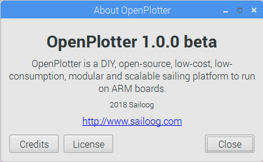

# Par où commencer?

Tout d'abord, il vaus faut assembler les éléments prérequis:



Puis, éxécuter le logiciel sur votre Raspberry. **OpenPlotter** est une version modifiée de Ra[spbian](https://www.raspbian.org/), l'OS officiel pour Raspberry Pi. Tout ce dont vous avez besoin est inclus. OpenPlotter est open-source et gratuit.

## Installer OpenPlotter

Raspberry Pi, ainsi que la plupart des systèmes inclus, utilise une carte SD en tant que disque dur. Presque toutes les cartes micro-SD-compatible fonctionneront avec votre Raspberry.


8GB minimum sont requis, mais 16GB sont recommandés.


Un bon commencement est de vérifier que la carte SD est formattée. Assurez-vous que votre ordinateur dispose d'un lecteur de Cartes SD intégré, à défault, vous pourrez en utiliser un USB.

* Télécharger [SD Formatter](https://www.sdcard.org/downloads/formatter_4/index.html) \(pour Windows ou Mac\) depuis le [site de l'Association SD Card](http://www.sdcard.org//).
* Suivre les instructions pour installer le logiciel.
* Insérer votre carte SD dans le lecteur de carte de l'ordinateur ou du portable  et noter le disque alloué`ici F:/`
* Dans SD Formatter, sélectionner le disque correspondant à votre carte SD et formater.


Si votre carte SD est de 64GB ou plus, elle sera automatiquement formatée en exFAT, ce qui n'est pas compatible avec OpenPlotter. Suivez ces [instructions](https://www.raspberrypi.org/documentation/installation/sdxc_formatting.md) pour forcer le formatage de votre carte SD en FAT32, afin de pouvoir utiliser.


* [Télécharger la dernière version d'](http://www.sailoog.com/blog-categories/openplotter-rpi)[**OpenPlotter**](http://www.sailoog.com/blog-categories/openplotter-rpi)[ sous NOOBS](http://www.sailoog.com/blog-categories/openplotter-rpi)**.** Il s'agit d'un fichier compressé ****de presque ****1GB, cela prendra donc un peu de temps. 
* Extraire les fichiers du dossier compressé **openplotter\_vx.x.x\_noobs.zip**
* Les copier tous sur le disque correspondant à la carte SD.
* Quand la copie est terminée, retirer avec sécurité la carte SD et l'insérer dans votre Raspberry Pi.

## Premier démarrage

Mettre le Raspberry Pi sous tension.

NOOBS procède à une installation silencieuse d'OpenPlotter, ce qui veut dire que vous n'avez rien à faire. Cela va prendre quelques minutes pour formater les partitions et installer le système.

Une fois fait, OpenPlotter démarrera directement, chaque fois que Raspberry Pi sera allumé.

La résolution native des écrans de 800x480 est automatiquement détectée. Le bon réglage pour que cela fonctionnement correctement sera opérationnel au prochain démarrage! Si vous avez un tel écran, re-démarrez.

OpenPlotter est configuré en tant que point d'accès WiFi par défaut. Le mot de passe pour s'y connecter est le suivant:

SSID: openplotter  
Mot de passe: 12345678


Vous devriez changer ce mot de passe dès que possible. Il y a d'autres paramétrages importants qui devraient être changés, rendez-vous sur [Première configuration](first-settings.md) pour savoir lesquels et comment.


Il est aussi possible d'exécuter OpenPlotter sans écran, en utilisant soit un portable, soit un ordinateur fixe, une tablette ou un smart-phone en tant que client bureau à distance.



## Mise à jour

Depuis la version v 0.10.0 d'OpenPlotter, il est possible de mettre à jour son installation sans avoir à flasher une nouvelle carte SD.

Assurez-vous d'être connecté à Internet et ouvrez allez à l'option _Updates,_ du menu principal d'OpenPlotter, puis _Update OpenPlotter_. OpenPlotter vérifiera alors si vous avez besoin d'une mise à jour mineure ou majeur et fera tout le travail pour vous.

Vous pouvez également mettre à jour OpenCPN et les plugins vers la dernière version stable et restaurer la configuration, si elle a changée après une mise à jour.

### Numérotation des versions {#version-numbering}

Les livraisons d'OpenPlotter ont trois nombres: **a**.**b**.**c** \(v0.10.0, v1.0.0...\) et un mot \(**alpha**, **beta** ou **stable**\).

Quand **c** augmente, il s'agit de d'une évolution mineure, et cela veut dire que seul le code d'OpenPlotter a changé. 

Quand **b** augmente, il s'agit d'une évolution majeure et cela veut dire que d'autres packages ou dépendances ont également besoin d'être ajoutés ou mise à jour.

Quand **a** augmente, il s'agit d'une montée de version et cela veut dire que Raspbian a également besoin d'être mis à jour. Dans ce cas, une nouvelle image d'OpenPlotter est publiée et il est nécessaire de flasher une nouvelle carte SD.

**Alpha** signifie que des parties sont encore en cours de développement. 

**Beta** signifie que tout a été développé, qu'il n'y a plus d'erreurs bloquantes mais que tous les tests, tous les scénarios n'ont pas encore été effectué par les utilisateurs. Les textes d'OpenPlotter sont traduits depuis l'anglais vers les autres langages à ce moment.

**Stable** signifie que tant le code d'OpenPlotter que toutes les dépendances ont été testées et qu'il n'y a plus d'erreur.

Vous pouvez savoir quelle version vous exécutez en choisissant l'option _About_ du menu _Help_.

## Sauvegarde

## Système de restauration

Si votre système est endommagé ou instable, vous pouvez le restaurer depuis le module d'installation de NOOBS, qui est stocké sur la carte SD et installe de nouveau OpenPlotter. Pour le lancer, appuyer la touche Shift quand vous voyez ce symbole au démarrage:


**En le faisant, vous perdrez toutes vos données, les logiciels installés manuellement, et tout le paramétrage effectué après l'installation.**


