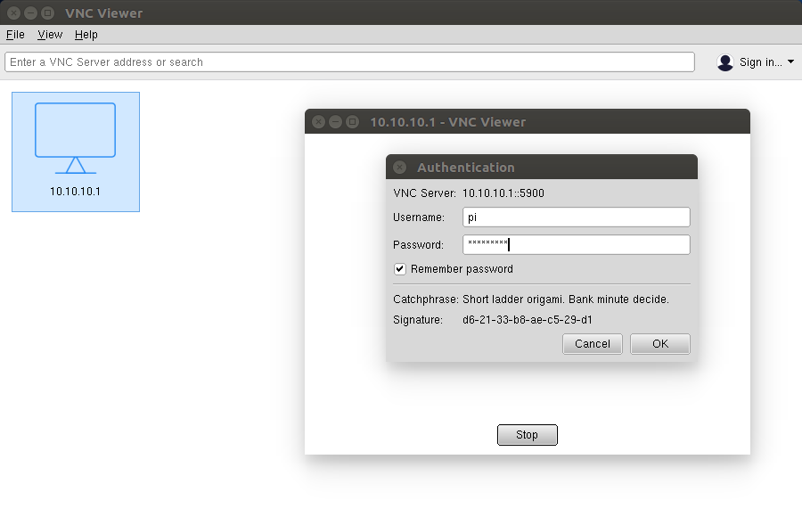

# Mode sans écran

## Premier démarrage

Après avoir créé la carte SD OpenPlotter sous NOOBS, l'insérer dans le Raspberry Pi, connecter l'alimentation et attendre l'apparition d'un nouveau réseau Wifi _openplotter_ dans la liste des points d'accès valides. Le process peut demander jusqu'à une demie heure pour se dérouler.

SSID: openplotter  
Mot de passe: 12345678

## Connexion

* Installer RealVNC Viewer sur votre portable, ordinateur, tablette ou smartphone
* Lancer VNC Viewer et sélectionner _Fichier -&gt; Nouvelle connexion_
* Renseigner l'adresse d'OpenPlotter et cliquer _OK._ Si OpenPlotter fonctionne en tant que point d'accès Wifi, son adresse est **10.10.10.1**_._ S'il est configuré comme client d'un autre point d'accès, vous devez trouver quelle adresse a été donnée à OpenPlotter au moment de sa connexion.

* Introduce the _Username_: pi
* Introduce the _Password_: raspberry
* Select _Remember password_, press _OK_ and you are in!

## Change passwords


Please change the WiFi access point defaul password and the _pi_ user default password as soon as possible. If you do not do this, anyone will be able to connect to your system. See _First settings._




