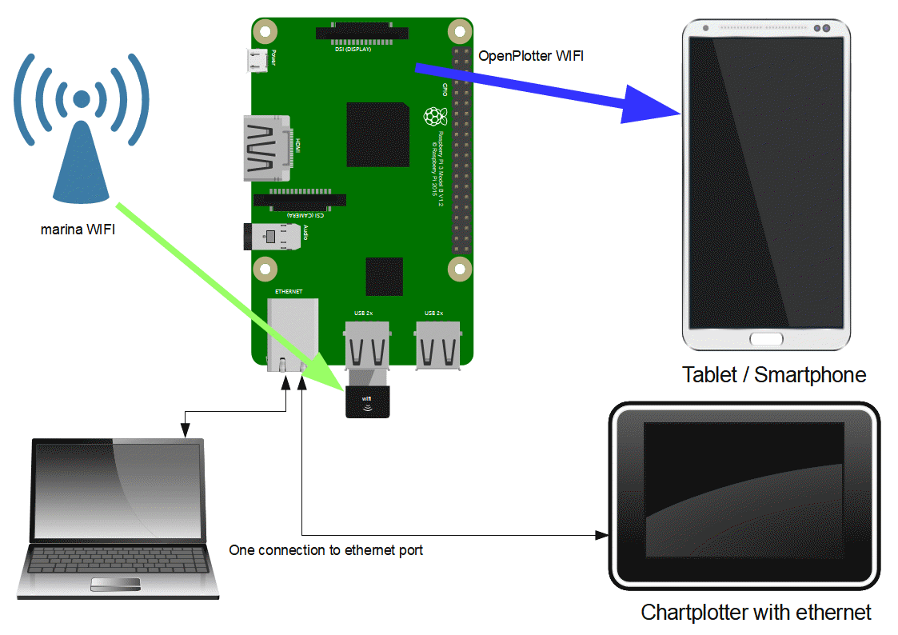
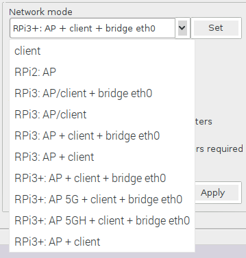
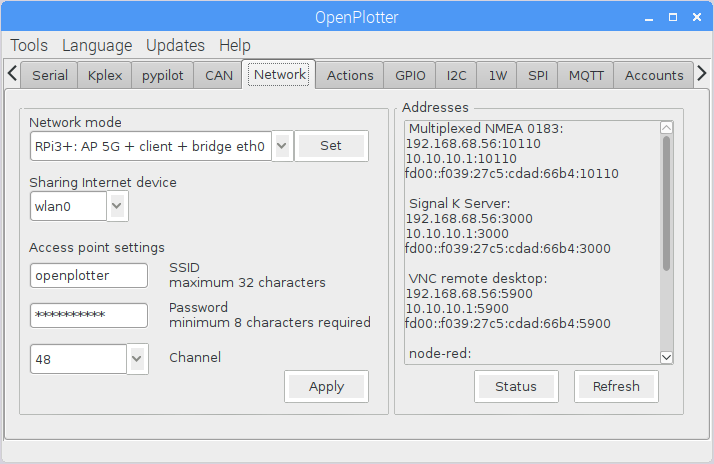

# Network

Network management has changed, now it is based on the native management system of Raspbian.

OpenPlotter can configure the built-in wlan device on Raspberry Pi 3 and 3+ to act as an Access Point \(AP\). On Raspberry Pi 3 you can also set the built-in wlan device to connect as a client to the AP of the harbour simultaneously. On Raspberry Pi 3+ you need an extra wlan device if you want to set OpenPlotter as AP and you want to connect to another AP as client too.

You can connect your mobile phone to the USB port and enable USB teathering to share the GSM/WLAN internet connection with all the devices connected to the AP OpenPlotter.

You can connect your laptop, plotter... to the ethernet port of the Raspberry and OpenPlotter can work as a router \(bridge to AP\).

Picture 1: RPI3:AP/client + bridge eth0
(The RPi works like a router getting the internet connection over wifi. If the chartplotter has an ethernet port and a remote control app "gofree". It can be controled by a tablet.
Or if you want to connect your notbook to the ethernet port.)

Picture 2: RPI3:AP + client + bridge eth0
(Same as Picture 1 but a second wifi device.)

Picture 3: RPI3:AP + client + bridge eth0
(Same as Picture 2 but an android smartphone connected by USB as a replacement for the wifi device.)

to Picture 3:
The smartphone can be connected to the marina wifi or to the gsm internet. 
Usb tethering must be activated (android auto disables it!).
Set "Sharing internet device" to USB0. This is importand when other clients which are connected to the OpenPlotter AP should get internet access.
_BTW: The tethered connection can be used to remote control the RPi with the VNC-viewer. You only need the IP address.
_

Choose one of the available standard configurations and click on _Set_ to enable it.

Choose the device which has the internet connection \(client\). OpenPlotter will  share it to the AP and to the ethernet port if a bridged mode is selected. Do not select wlan1 or uap0 \(AP\) in _Share internet device_.


If you set a mode that is not _client_, wlan0 will be always the client and wlan1 or uap0 will be always the AP.


You can change the name of the AP \(SSID\).


You must change the password every time you set a new mode. If you do not change this, the password will be the default **12345678** and anyone will be able to connect to your system!!!


You can change the channel.


Channel until max 13 can be used for 2.4 GHz. Channel starting at 44 can be used for 5 GHz. The channels allowed in your country are set by the country code. OpenPlotter does not check if you set a wrong channel!


Click _Apply_ to write the configuration. **It will be activated after next boot**.


On Raspberry Pi 3 you can use the built-in wifi device as AP and client. No USB wlan stick is needed!

**Advantage**  
Less power consumption.  
A free USB port.  
You do not have to change the network mode when you are in harbour.

**Disadvantage**  
Lower download performance.  
OpenPlotter must be in a good place to get a good internet connection (unrealistic).


