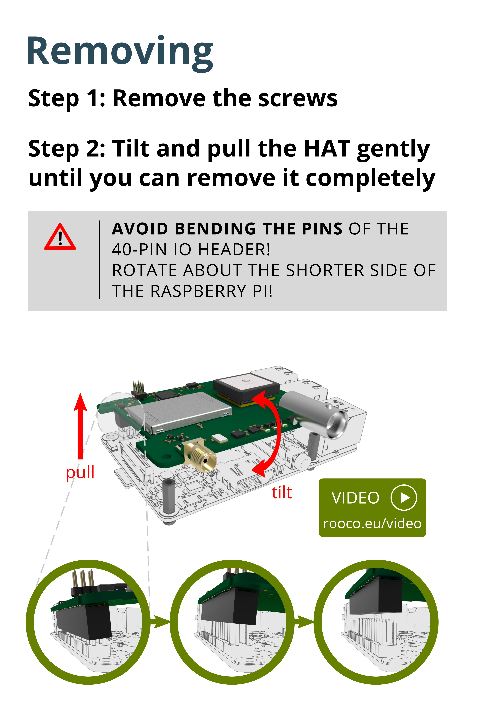

# Moitessier HAT

## Eigenschaften

* Hoch empfindlicher \(besser als -114 dBm\) **Zwei-Kanal AIS Empfänger** mit SMA Antennen-Anschluß
* Hochleistungs-**GNSS Empfänger** mit integrierter Antenne und zusätzlichem BNC-Antennenanschluß
* **Kompaß, Rollen und Nicken** vom IMU-Sensor \(Kreiselsensor, Beschleunigungsmesser und  Magnetometer\)
* **Luftdruck-Sensor**
* Unabhängige Nutzung oder in Verbindung mit Raspberry Pi. Auf sie Sensoren kann direkt vom Raspberry Pi zugegriffen werden. Die unabhängige Nutzung erfordert 3.3V Spannungsversorgung, die Sensoren werden durch den Microcontroller des HAT kontrolliert
* Voll kompatibel mit Raspberry Pi Modellen mit 40-pin IO Header
* Datentransfer über SPI \(AIS, GNSS und Meta-Daten\) und über I2C \(Sensoren\). Die Daten sind über Gerätetreiber und Dateien abzurufen
* Unterstützt ID EEPROM und automatisches Device Tree Loading
* 3 Status LEDs \(AIS Status, GNSS Status, Fehler\)
* Vollständig OpenPlotter kompatibel. Plug and play.


Dieses Teil ist in unserem Web Shop erhältlich


## Montage des HAT

### Gehäuse


Dieses Teil ist in unserem Web Shop erhältlich


### External antennas


Dieses Teil ist in unserem Web Shop erhältlich


## Treiberinstallation

## GNSS, AIS Einstellungen

## Einstellungen für Kompaß, Rollen und Nicken



## Einstellung des Luftdruck-Sensors

## HAT-Informationen auslesen

